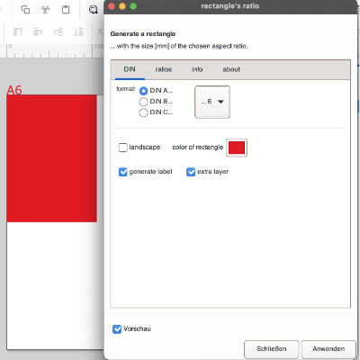
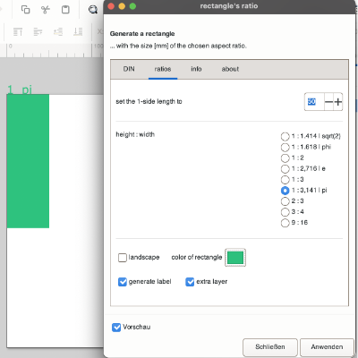
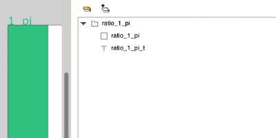

# Inkscape Extension: draw rectangle
  

## description
This Inkcscape extension creates a rectangle with a ratio of side lengths according to a selection: This selection consists of the DIN formats (A, B and C formats) and special formats such as 1:2, 3:4, 9:16, but also 1:pi, 1:e as well as the golden ratio (1:phi).

## instructions
Choose a ratio for the side lengths of a rectangle and generate one with it. You can choose between DIN (Deutsches Institut für Normung e. V.; DIN A-B-C-series) and other predefined ratios like 1:3, 3:4, 9:16 or the golden ratio.

The special values, some of which cannot be represented by fractions, are derived mathematically and rounded only at the end. Thus, the deviations should be quite small and sufficiently accurate.

## additional information
DIN B- and DIN C-series depend on the DIN A-series. The ratio between the short and long side length of the DIN rectangle is always 1 to square root of 2 (approximately 1.414). This results mathematically from the conditions: DIN A0 should have an area of 1 square meter and halving the longer side length results in two similar rectangles (similar in the mathematical sense of equal ratios of side lengths).

Probably the most well-known constant in design is the golden ratio, often denoted by phi=1.6180339...: The golden section corresponds to a division of a distance into two partial distances, so that the longer partial distance behaves to the shorter partial distance like the total distance behaves to the longer partial distance. The length of the longer side corresponds to about 61.8% of the original total length.

## sources
... in no particular order
- [1] [https://www.linux-magazine.com/Issues/2020/239/Magic-Circle](https://www.linux-magazine.com/Issues/2020/239/Magic-Circle)
- [2] [https://inkscapetutorial.org/pages/extension.html](https://inkscapetutorial.org/pages/extension.html)
- [3] [https://inkscape.gitlab.io/extensions/documentation/](https://inkscape.gitlab.io/extensions/documentation/)
- [4] [https://www.onlineprinters.de/magazin/din-formate/](https://www.onlineprinters.de/magazin/din-formate/)
- [5] [https://home.ph-freiburg.de/deisslerfr/geometrie_II/sicher_geoII_05_06_loesungen/din-format-loesungen.pdf](https://home.ph-freiburg.de/deisslerfr/geometrie_II/sicher_geoII_05_06_loesungen/din-format-loesungen.pdf)
- [6] [https://www.home.uni-osnabrueck.de/gskalla/Eigene/papierformat.html](https://www.home.uni-osnabrueck.de/gskalla/Eigene/papierformat.html)
- [7] [https://www.din-formate.de/berechnung-format-reihe-din-b0-b1-b2-b3-b4-b5-b6-b7-b8-b9-b10-seiten-masse-papier-groesse-in-mm-qm.html](https://www.din-formate.de/berechnung-format-reihe-din-b0-b1-b2-b3-b4-b5-b6-b7-b8-b9-b10-seiten-masse-papier-groesse-in-mm-qm.html)
- [8] [https://gitlab.com/inkscape/extensions/-/blob/master/text_merge.py](https://gitlab.com/inkscape/extensions/-/blob/master/text_merge.py)

## Lizenz
Creative Commons Attribution-NonCommercial 4.0 International [(CC BY-NC 4.0) ](https://creativecommons.org/licenses/by-nc/4.0/)

## screenshots

